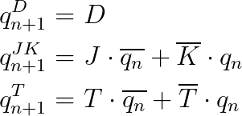

## Characteristic equations and truth tables for D, JK, T flip-flops

   
   <!--
   https://editor.codecogs.com/
   \begin{align*}
       q_{n+1}^D =&~D \\
       q_{n+1}^{JK} =&~J\cdot\overline{q_{n}} + \overline{K}\cdot q_{n} \\
       q_{n+1}^T =&~T\cdot\overline{q_{n}} + \overline{T}\cdot q_{n} \\
   \end{align*}
   -->

   **D-type FF**
   | **clk** | **d** | **q(n)** | **q(n+1)** | **Comments** |
   | :-: | :-: | :-: | :-: | :-- |
   |  | 0 | 0 | 0 | `q(n+1)` has the same level as `d` |
   |  | 0 | 1 | 0 | `q(n+1)` has the same level as `d` |
   |  | 1 | 0 | 1 | `q(n+1)` has the same level as `d` |
   |  | 1 | 1 | 1 | `q(n+1)` has the same level as `d` |

   **JK-type FF**
   | **clk** | **j** | **k** | **q(n)** | **q(n+1)** | **Comments** |
   | :-: | :-: | :-: | :-: | :-: | :-- |
   |  | 0 | 0 | 0 | 0 | Output did not change |
   |  | 0 | 0 | 1 | 1 | Output did not change |
   |  | 0 | 1 | 0 | 0 | Output reset |
   |  | 0 | 1 | 1 | 0 | Output reset |
   |  | 1 | 0 | 0 | 1 | Output set to j |
   |  | 1 | 0 | 1 | 1 | Output set to j |
   |  | 1 | 1 | 0 | 1 | Output invert |
   |  | 1 | 1 | 1 | 0 | Output invert |

   **T-type FF**
   | **clk** | **t** | **q(n)** | **q(n+1)** | **Comments** |
   | :-: | :-: | :-: | :-: | :-- |
   |  | 0 | 0 | 0 | Output did not change |
   |  | 0 | 1 | 1 | Output did not change |
   |  | 1 | 0 | 1 | Output invert |
   |  | 1 | 1 | 0 | Output invert |
