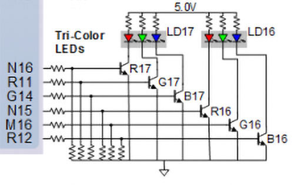

# Connection of two RGB LEDs:
   | **RGB LED** | **Artix-7 pin names** | **Red** | **Yellow** | **Green** |
   | :-: | :-: | :-: | :-: | :-: |
   | LD16 | N15, M16, R12 | `1,0,0` | `1,1,0` | `0,1,0` |
   | LD17 | N16, R11, G14 | `1,0,0` | `1,1,0` | `0,1,0` |
   
   Schematic:
      

# Pmod ports JA, JB, JC, JD <-> FPGA pins connection:
   | **Pmod JA** | **Pmod JB** | **Pmod JC** | **Pmod JD** |
   | :-: | :-: | :-: | :-: |
   | JA1: C17  | JB1: D14 | JC1: K1 | JD1: H4 |
   | JA2: D18  | JB2: F16 | JC2: F6 | JD2: H1 |
   | JA3: E18  | JB3: G16 | JC3: J2 | JD3: G1 |
   | JA4: G17  | JB4: H14 | JC4: G6 | JD4: G3 |
   | JA7: D17  | JB7: E16 | JC7: E7 | JD7: H2 |
   | JA8: E17  | JB8: F13 | JC8: J3 | JD8: G4 |
   | JA9: F18  | JB9: G13 | JC9: J4 | JD9: G2 |